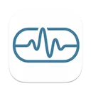
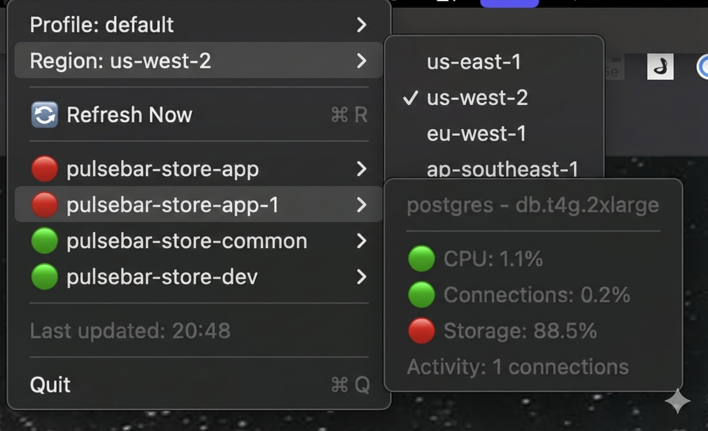

<p align="center">
  
</p>

<h1 align="center">PulseBar - RDS Monitor</h1>

<p align="center">
  A macOS menu bar app for monitoring AWS RDS instances with real-time health metrics and alerts.
</p>

<p align="center">
  
  
  
</p>

<p align="center">
  
</p>

## Features

- 📊 **Real-time Monitoring**: Track CPU, connections, storage, and activity for all RDS instances
- ⚡ **Auto-refresh**: Updates every 15 minutes automatically
- 🔔 **Smart Alerts**: macOS notifications when metrics exceed 50% (with deduplication)
- 🎨 **Color-coded Status**: Green (<50%), Yellow (50-75%), Red (>75%)
- 🔐 **AWS Integration**: Uses your existing `~/.aws/credentials` and `~/.aws/config`
- 🌍 **Multi-region/Profile**: Switch between AWS profiles and regions easily

## Metrics Tracked

For each RDS instance:

| Metric | Source | Description |
|--------|--------|-------------|
| **CPU Utilization** | CloudWatch `CPUUtilization` | Current CPU usage percentage |
| **Connections Used** | `DatabaseConnections / max_connections × 100` | Percentage of connection pool used |
| **Storage Used** | `(AllocatedStorage - FreeStorageSpace) / AllocatedStorage × 100` | Percentage of disk space used |
| **Activity** | CloudWatch `DatabaseConnections` | Current number of database connections |

## Requirements

- macOS 13.0 or later
- Swift 5.9+
- AWS credentials configured at `~/.aws/credentials`
- IAM permissions:
  - `rds:DescribeDBInstances`
  - `cloudwatch:GetMetricData`

## Installation

### Option 1: Download Pre-built Release

1. Go to the [Releases page](../../releases)
2. Download the latest `PulseBar-vX.X.X-macOS.zip`
3. Unzip and move to Applications:
   ```bash
   unzip PulseBar-vX.X.X-macOS.zip
   mv PulseBar.app /Applications/
   ```
4. **First launch** (app is unsigned, so macOS will block it):
   - Right-click `PulseBar.app` → **Open** → Click **Open** in the dialog
   - Or run: `xattr -cr /Applications/PulseBar.app`

### Option 2: Build from Source

```bash
# Clone the repository
git clone <repository-url>
cd PulseBar

# Build and install to /Applications
make install
```

### Option 3: Build and Run Locally

```bash
# Run in debug mode
make run

# Or build release binary
make build
```

> **Note**: When running via `make run` (without app bundle), macOS notifications are disabled. Use `make install` for full functionality.

## AWS Credentials Setup

Ensure you have AWS credentials configured:

```ini
# ~/.aws/credentials
[default]
aws_access_key_id = YOUR_ACCESS_KEY
aws_secret_access_key = YOUR_SECRET_KEY

[production]
aws_access_key_id = PROD_ACCESS_KEY
aws_secret_access_key = PROD_SECRET_KEY
```

```ini
# ~/.aws/config
[default]
region = us-west-2

[profile production]
region = us-east-1
```

### Required IAM Permissions

```json
{
  "Version": "2012-10-17",
  "Statement": [{
    "Effect": "Allow",
    "Action": [
      "rds:DescribeDBInstances",
      "cloudwatch:GetMetricData"
    ],
    "Resource": "*"
  }]
}
```

## Usage

1. Launch PulseBar from Applications or run `make run`
2. Click the 📊 icon in your menu bar
3. Select your AWS profile and region
4. View real-time metrics for all RDS instances
5. Click on any instance to see detailed metrics

### Menu Options

- **Profile Selector**: Switch between AWS profiles
- **Region Selector**: Change AWS region (us-east-1, us-west-2, eu-west-1, etc.)
- **Refresh Now**: Manual refresh (⌘R)
- **Instance List**: Click any instance for details
- **Quit**: Exit the application (⌘Q)

### Understanding the Display

```
🟢 my-database-prod          # Green = all metrics healthy (<50%)
   postgres - db.r5.large    # Engine and instance class
   🟢 CPU: 12.5%             # CPU utilization
   🟢 Connections: 23.1%     # Connection pool usage
   🔴 Storage: 78.2%         # Storage used (red = >75%)
   Activity: 14 connections  # Raw connection count
```

**Color Coding:**
- 🟢 Green: < 50% (healthy)
- 🟡 Yellow: 50-75% (warning)
- 🔴 Red: > 75% (critical)
- ⚪ Gray: N/A (data unavailable)

## Alert Behavior

Notifications are sent when any metric exceeds 50%:

- Alerts are deduplicated (won't spam for the same condition)
- New notifications sent if:
  - Different metrics breach thresholds
  - Instance recovers and breaches again
  - 15+ minutes since last alert for same condition

Example notification:
```
⚠️ RDS Alert: production-db
CPU: 72%
Connections: 61%
```

> **Note**: Notifications only work when running as an installed app bundle (`make install`), not via `swift run`.

## Architecture

```
Timer (15 min)
   ↓
Load AWS Profile/Credentials
   ↓
DescribeDBInstances (RDS API)
   ↓
GetMetricData (CloudWatch API) - 1 hour window
   ↓
Metric Calculations
   ↓
UI Update + Alert Engine
   ↓
macOS Notification Center
```

## Project Structure

```
PulseBar/
├── Sources/
│   ├── main.swift                    # App entry point
│   ├── AppDelegate.swift             # Menu bar UI & coordination
│   ├── AWSCredentialsReader.swift    # Reads ~/.aws files
│   ├── RDSMonitoringService.swift    # AWS SDK integration
│   ├── AlertManager.swift            # Notification logic
│   └── Models.swift                  # Data structures
├── Assets/
│   └── screenshot.png                # App screenshot
├── icons/
│   └── *.png                         # App icons (16-1024px)
├── .github/
│   ├── PULL_REQUEST_TEMPLATE.md      # PR template
│   └── workflows/
│       ├── pr-validation.yml         # PR build checks
│       └── release.yml               # Auto-build on release
├── Package.swift                     # Swift Package Manager config
├── Info.plist                        # App metadata
├── Makefile                          # Build commands
├── README.md                         # This file
├── CONTRIBUTING.md                   # Contribution guidelines
├── CODE_OF_CONDUCT.md                # Community standards
├── SECURITY.md                       # Security policy
├── LICENSE                           # MIT License
└── agents.md                         # Developer/AI agent guide
```

## Development

### Build Commands

```bash
make run      # Debug build and run
make build    # Release build (.build/release/PulseBar)
make clean    # Clean build artifacts
make install  # Install to /Applications
make help     # Show all commands
```

### Dependencies

- `aws-sdk-swift` v0.40.0+ (AWSRDS, AWSCloudWatch)

Dependencies are managed via Swift Package Manager and will be automatically resolved on build.

## CI/CD

This project uses GitHub Actions for:

- **PR Validation**: Builds and validates code on every pull request
- **Release Build**: Automatically builds and attaches binaries when a GitHub release is published

See `.github/workflows/` for details.

## Limitations (v1)

- No historical graphs or trends
- Basic max_connections estimation (not querying parameter groups)
- No Performance Insights integration
- Single account only (no multi-account aggregation)
- Read-only monitoring (cannot modify RDS instances)
- Notifications require app bundle (not available via `swift run`)

## Troubleshooting

### "App is damaged" or "Can't be opened"

The app is unsigned, so macOS Gatekeeper blocks it. Fix with one of these:

**Option 1:** Right-click the app → **Open** → Click **Open** in the dialog

**Option 2:** Run in terminal:
```bash
xattr -cr /Applications/PulseBar.app
```

### "No credentials found"

Ensure `~/.aws/credentials` exists and has valid credentials for the selected profile.

### "Permission denied"

Verify your IAM user/role has these permissions:
- `rds:DescribeDBInstances`
- `cloudwatch:GetMetricData`

### Storage shows "N/A"

CloudWatch may not have recent data. The app queries a 1-hour window; if no data exists, it shows N/A.

### Notifications not appearing

1. Ensure you're running the installed app (`/Applications/PulseBar.app`), not `swift run`
2. Check System Settings → Notifications → PulseBar
3. Ensure notifications are enabled
4. Restart the app if needed

### High CPU/memory usage during first run

The first build downloads and compiles AWS SDK dependencies (~200 MB). Subsequent runs will be fast.

## License

MIT License - See LICENSE file for details

## Contributing

Contributions welcome! Please read our [Contributing Guidelines](CONTRIBUTING.md) before getting started.

1. Fork the repository
2. Create a feature branch
3. Make your changes
4. Submit a pull request

For architecture and technical details, see [agents.md](agents.md).

## Roadmap

- [ ] Parameter group querying for accurate max_connections
- [ ] Historical metric graphs
- [ ] Performance Insights integration
- [ ] Multi-account support
- [ ] Custom alert thresholds
- [ ] Export metrics to CSV/JSON
- [ ] Sparkline trends in menu
