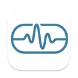
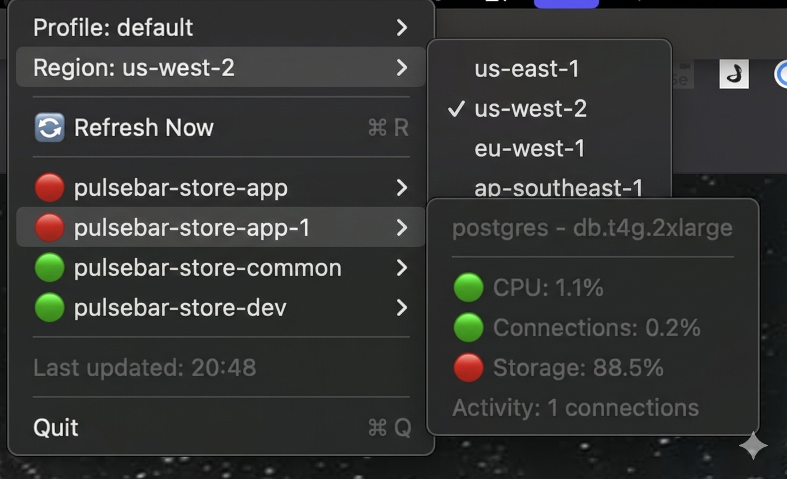

<p align="center">
  
</p>

<h1 align="center">PulseBar - RDS Monitor</h1>

<p align="center">
  A macOS menu bar app for monitoring AWS RDS instances with real-time health metrics and alerts.
</p>

<p align="center">
  
  
  
</p>

<p align="center">
  
</p>

## Features

- 📊 **At-a-glance Monitoring**: CPU, connections, sessions, and storage for every RDS instance, right in the menu bar
- 📈 **Detail Dashboard**: Click any database for a popup with six time-series charts (CPU, Memory, Storage) over the last **1 day / 7 days / 30 days**
- 🔍 **Performance Insights**: Top SQL queries, users, and hosts by average active sessions (when PI is enabled)
- ⚡ **Auto-refresh**: Menu-bar metrics update every 15 minutes automatically
- 🔔 **Smart Alerts**: macOS notifications when metrics exceed 50% (with deduplication), plus an always-visible in-menu alert banner
- 🎨 **Color-coded Status**: Green (<50%), Yellow (50-75%), Red (>75%)
- 🔐 **AWS Integration**: Uses your existing `~/.aws/credentials` and `~/.aws/config`
- 🌍 **Multi-region/Profile**: Switch between AWS profiles and regions easily

## Metrics Tracked

**In the menu bar**, for each RDS instance:

| Metric          | Source                                                     | Description                          |
| --------------- | ---------------------------------------------------------- | ------------------------------------ |
| CPU Utilization | CloudWatch `CPUUtilization`                                | Current CPU usage percentage         |
| Connections     | `DatabaseConnections / max_connections × 100`              | Percentage of connection pool used   |
| Sessions        | CloudWatch `DBLoad` (falls back to `DatabaseConnections`)  | Average active sessions              |
| Storage         | `(AllocatedStorage - FreeStorageSpace) / AllocatedStorage` | Percentage of disk space used        |

**In the detail dashboard** (click a database), six charts grouped by type:

| Group   | Charts                                          |
| ------- | ----------------------------------------------- |
| CPU     | `CPUUtilization`, `DBLoad` (avg active sessions) |
| Memory  | `FreeableMemory`, `SwapUsage`                   |
| Storage | `FreeStorageSpace`, `ReadIOPS` + `WriteIOPS`    |

## Requirements

- macOS 13.0 or later
- Swift 5.9+
- AWS credentials configured at `~/.aws/credentials`
- IAM permissions:
  - `rds:DescribeDBInstances`
  - `cloudwatch:GetMetricData`
  - `pi:DescribeDimensionKeys` *(optional — only for the Top Queries/Users/Hosts panels)*

## Installation

### Option 1: Download Pre-built Release

1. Go to the [Releases page](../../releases)
2. Download the latest `PulseBar-vX.X.X-macOS.zip`
3. Unzip and move to Applications:
   ```bash
   unzip PulseBar-vX.X.X-macOS.zip
   mv PulseBar.app /Applications/
   ```
4. **First launch** (app is unsigned, so macOS will block it):
   - Right-click `PulseBar.app` → **Open** → Click **Open** in the dialog
   - Or run: `xattr -cr /Applications/PulseBar.app`

### Option 2: Build from Source

```bash
# Clone the repository
git clone <repository-url>
cd PulseBar

# Build and install to /Applications
make install
```

### Option 3: Build and Run Locally

```bash
# Run in debug mode
make run

# Or build release binary
make build
```

> **Note**: When running via `make run` (without app bundle), macOS notifications are disabled. Use `make install` for full functionality.

## AWS Credentials Setup

Ensure you have AWS credentials configured:

```ini
# ~/.aws/credentials
[default]
aws_access_key_id = YOUR_ACCESS_KEY
aws_secret_access_key = YOUR_SECRET_KEY

[production]
aws_access_key_id = PROD_ACCESS_KEY
aws_secret_access_key = PROD_SECRET_KEY
```

```ini
# ~/.aws/config
[default]
region = us-west-2

[profile production]
region = us-east-1
```

### Required IAM Permissions

```json
{
  "Version": "2012-10-17",
  "Statement": [{
    "Effect": "Allow",
    "Action": [
      "rds:DescribeDBInstances",
      "cloudwatch:GetMetricData",
      "pi:DescribeDimensionKeys"
    ],
    "Resource": "*"
  }]
}
```

> `pi:DescribeDimensionKeys` is only needed for the Performance Insights panels (Top Queries/Users/Hosts). PulseBar works without it — those panels simply show a "not enabled" notice.

## Usage

1. Launch PulseBar from Applications or run `make run`
2. Click the chart icon in your menu bar
3. Select your AWS profile and region
4. View at-a-glance metrics for all RDS instances
5. Hover an instance and choose **📊 Open Details…** to open the full dashboard with charts and Performance Insights

### Menu Options

- **Profile Selector**: Switch between AWS profiles
- **Region Selector**: Change AWS region (us-east-1, us-west-2, eu-west-1, etc.)
- **Refresh Now**: Manual refresh (⌘R)
- **Instance List**: Click any instance for details
- **Quit**: Exit the application (⌘Q)

### Understanding the Display

```
🟢 my-database-prod          # Green = all metrics healthy (<50%)
   📊 Open Details…          # Opens the charts + Performance Insights dashboard
   postgres - db.r5.large    # Engine and instance class
   🟢 CPU: 12.5%             # CPU utilization
   🟢 Connections: 23.1%     # Connection pool usage
   Sessions: 1.42 avg active # Average active sessions (DBLoad)
   🔴 Storage: 78.2%         # Storage used (red = >75%)
   Activity: 14 connections  # Raw connection count
```

**Color Coding:**
- 🟢 Green: < 50% (healthy)
- 🟡 Yellow: 50-75% (warning)
- 🔴 Red: > 75% (critical)
- ⚪ Gray: N/A (data unavailable)

**Status Messages:**
- ⏳ Loading... - Fetching data from AWS
- ⚠️ AWS credentials not found - Missing `~/.aws/credentials` file
- 🔐 Invalid credentials - Credentials expired or invalid
- 📭 No RDS instances found - No databases in the selected region

## Alert Behavior

Notifications are sent when any metric exceeds 50%:

- Alerts are deduplicated (won't spam for the same condition)
- New notifications sent if:
  - Different metrics breach thresholds
  - Instance recovers and breaches again
  - 15+ minutes since last alert for same condition

Example notification:
```
⚠️ RDS Alert: production-db
CPU: 72%
Connections: 61%
```

> **Note**: System notifications are most reliable from an installed, signed app bundle (`make install`). For local builds, PulseBar falls back to a legacy notification path and always shows an **alert banner at the top of the menu**, so breaching instances are visible regardless of notification permissions.

## Architecture

```
Timer (15 min)
   ↓
Load AWS Profile/Credentials
   ↓
DescribeDBInstances (RDS API)
   ↓
GetMetricData (CloudWatch API) — latest scalar values
   ↓
Metric Calculations
   ↓
Menu UI Update + Alert Engine (notifications + in-menu banner)

Click "Open Details…"
   ↓
GetMetricData (1d/7d/30d range)  +  DescribeDimensionKeys (Performance Insights)
   ↓
SwiftUI + Charts dashboard (NSHostingView in a floating NSWindow)
```

## Project Structure

```
PulseBar/
├── Sources/
│   ├── main.swift                          # App entry point
│   ├── AppDelegate.swift                   # Menu bar UI & coordination
│   ├── AWSCredentialsReader.swift          # Reads ~/.aws files
│   ├── RDSMonitoringService.swift          # AWS SDK integration (RDS, CloudWatch, PI)
│   ├── AlertManager.swift                  # Notification logic
│   ├── DatabaseDetailWindowController.swift # Detail window + view model
│   ├── MetricsDashboardView.swift          # SwiftUI + Charts dashboard
│   └── Models.swift                        # Data structures
├── Assets/
│   └── screenshot.png                      # App screenshot
├── Icons/
│   └── *.png                               # App icons (16-1024px)
├── .github/
│   ├── ISSUE_TEMPLATE/                      # Bug report & feature request templates
│   ├── PULL_REQUEST_TEMPLATE.md            # PR template
│   └── workflows/
│       ├── pr-validation.yml               # PR build checks
│       └── release.yml                     # Auto-build on release
├── Package.swift                     # Swift Package Manager config
├── Info.plist                        # App metadata
├── Makefile                          # Build commands
├── README.md                         # This file
├── CONTRIBUTING.md                   # Contribution guidelines
├── CODE_OF_CONDUCT.md                # Community standards
├── SECURITY.md                       # Security policy
├── LICENSE                           # MIT License
└── agents.md                         # Developer/AI agent guide
```

## Development

### Build Commands

```bash
make run      # Debug build and run
make build    # Release build (.build/release/PulseBar)
make clean    # Clean build artifacts
make install  # Install to /Applications
make help     # Show all commands
```

### Dependencies

- `aws-sdk-swift` v0.40.0+ (AWSRDS, AWSCloudWatch, AWSPI)
- `SwiftUI` and `Charts` (system frameworks, macOS 13+) for the detail dashboard

Dependencies are managed via Swift Package Manager and will be automatically resolved on build.

## CI/CD

This project uses GitHub Actions for:

- **PR Validation**: Builds and validates code on every pull request
- **Release Build**: Automatically builds and attaches binaries when a GitHub release is published

See `.github/workflows/` for details.

## Limitations

- Basic `max_connections` estimation (not querying parameter groups)
- Performance Insights panels require PI to be enabled on the instance and `pi:DescribeDimensionKeys` permission
- Single account only (no multi-account aggregation)
- Read-only monitoring (cannot modify RDS instances)
- System notifications are most reliable from a signed, installed app bundle (an in-menu alert banner always works as a fallback)

## Troubleshooting

### "App is damaged" or "Can't be opened"

The app is unsigned, so macOS Gatekeeper blocks it. Fix with one of these:

**Option 1:** Right-click the app → **Open** → Click **Open** in the dialog

**Option 2:** Run in terminal:
```bash
xattr -cr /Applications/PulseBar.app
```

### "AWS credentials not found"

The app can't find `~/.aws/credentials`. Set up AWS credentials:

```bash
# Option 1: Use AWS CLI
aws configure

# Option 2: Create manually
mkdir -p ~/.aws
cat > ~/.aws/credentials << EOF
[default]
aws_access_key_id = YOUR_KEY
aws_secret_access_key = YOUR_SECRET
EOF
```

### "Invalid credentials" / "Profile not found"

- Verify the selected profile exists in `~/.aws/credentials`
- If using temporary credentials (SSO, assumed role), refresh them
- Check credentials haven't expired

### "Permission denied"

Verify your IAM user/role has these permissions:
- `rds:DescribeDBInstances`
- `cloudwatch:GetMetricData`
- `pi:DescribeDimensionKeys` *(only for Performance Insights panels)*

### Storage shows "N/A"

CloudWatch may not have recent data. The app queries a 1-hour window; if no data exists, it shows N/A.

### Sessions or Performance Insights show "No data"

`DBLoad` and the Top Queries/Users/Hosts panels require **Performance Insights to be enabled** on the instance. When it's off, the Sessions row falls back to the raw connection count and the dashboard panels show a notice.

### Notifications not appearing

1. Ensure you're running the installed app (`/Applications/PulseBar.app`), not `swift run`
2. Check System Settings → Notifications → PulseBar
3. Ensure notifications are enabled
4. Restart the app if needed

Even when system notifications are blocked, PulseBar shows an **alert banner at the top of the menu** listing any instances that are breaching thresholds — so you never miss an alert.

### High CPU/memory usage during first run

The first build downloads and compiles AWS SDK dependencies (~200 MB). Subsequent runs will be fast.

## License

MIT License - See LICENSE file for details

## Contributing

Contributions welcome! Please read our [Contributing Guidelines](CONTRIBUTING.md) before getting started.

1. Fork the repository
2. Create a feature branch
3. Make your changes
4. Submit a pull request

For architecture and technical details, see [agents.md](agents.md).

## Roadmap

- [x] Historical metric graphs (detail dashboard)
- [x] Performance Insights integration (top queries/users/hosts)
- [ ] Parameter group querying for accurate `max_connections`
- [ ] Multi-account support
- [ ] Custom alert thresholds
- [ ] Export charts to CSV/PNG
- [ ] RDS events & CloudWatch alarms panel
- [ ] Sparkline trends in menu
